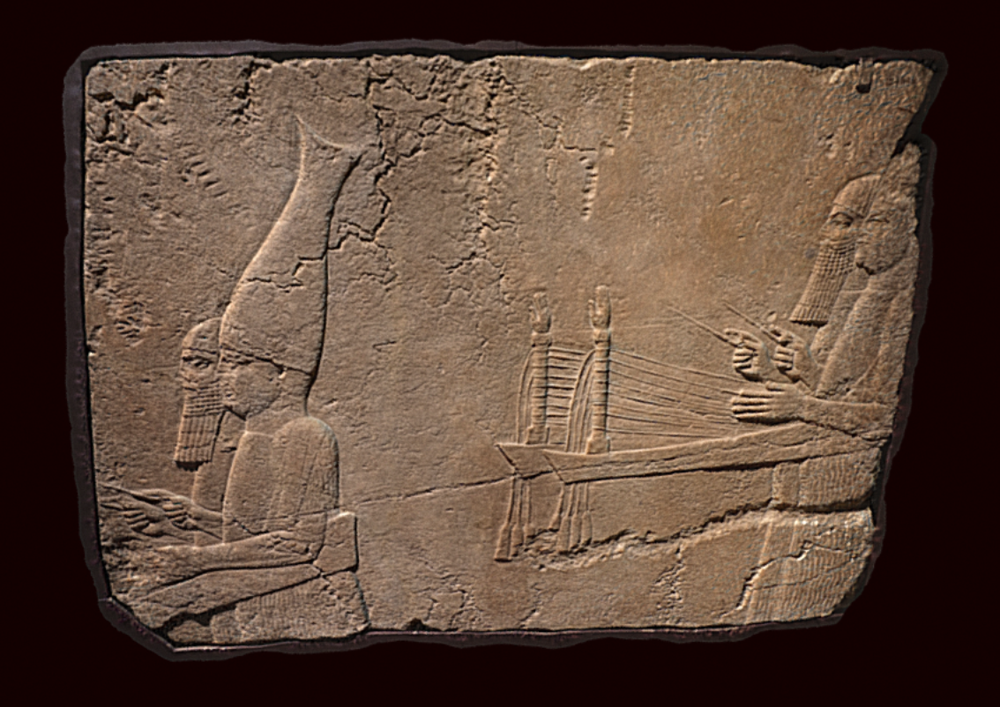

[](http://creativecommons.org/licenses/by-sa/4.0/) 
[](http://orcid.org/0000-0002-0246-2335)

# Court music: South west palace of Nineveh




This repository contains source data to recreate a 3D model from the British Museum's Assyrian collection and currently on display in the Ahurbanipal exhibition.. The file structure is as follows:

```
ladders/
├── README.md
├── LICENSE.md
├── images
├── masks
├── other
|── cameras
└── models
   |-OBJ
   |-STL
   |-PLY
```
Models are included as PLY, OBJ and STL representations. 

# Metadata 

Gypsum wall panel relief: showing two pairs of male musicians, those on right playing horizontal harps with hands and sticks. The left side of the musicians’ instruments are mostly missing. One of the musicians is beardless and wears the tall, fishtail hat of a priest.

A gypsum panel from the time of Sennacherib, 704 BC - 681 BC (circa)

Height: 138.43 centimetres Length: 106.68 centimetres

20 photographs, Sony A6000 processed in Photoscan pro. Currently on display in the Ashurbanipal exhibition. Collections record: https://goo.gl/6rYgVJ

# LICENSE
The contents of this repository are licensed under CC-BY

# Credits

Photographs and models by Daniel Pett - 26 Huawei mobile phone. 
